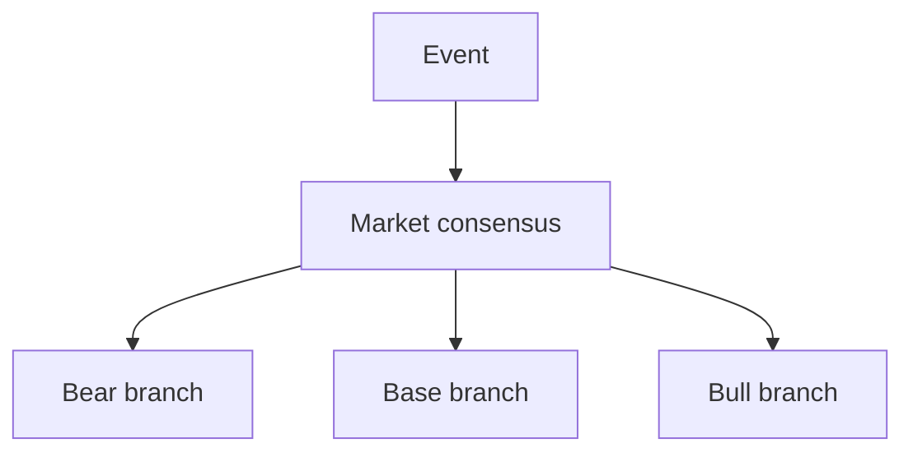

# Analyze Event Impact

## Quick Start

已进入 `analyze-event-impact`。

你可以把它理解成一个“事件影响分析器”：
给我一个事件、一个资产、一个时间范围，我会帮你拆它对价格的影响路径、市场可能已经定价了什么、以及还有哪些预期差。

你不需要一次把信息填满。
如果你有私域资料、内部研究、历史案例，可以一起贴给我；
如果没有，也没关系，只写核心判断就能开始。
不确定的地方直接写 `不确定` 或 `不知道`。

你可以直接填这个最简版：

```text
事件：
相关资产：
我的核心判断：
我觉得市场已经定价了什么：
我觉得市场可能忽视了什么：
我关心的时间范围：
```

如果你想更完整一点，也可以填这个版本：

```text
事件是什么：
目前状态：
事件阶段：
相关资产：
你觉得市场现在在相信什么：
你觉得市场已经定价了多少：
你觉得市场可能忽视了什么：
你关心的时间范围：
可补充的私域资料/个人判断：
```

我拿到后会默认给你：
1. `一句话结论`
2. `情景表`
3. `影响路径拆解`
4. `已定价 / 未定价判断`
5. `关键验证信号`
6. `风险点和失效条件`

如果你想，我也可以最后帮你整理成：
- `Markdown 报告`
- `PDF 报告`

## Overview

Use this skill to convert an event into a defensible market-impact analysis.

Treat the skill as the workflow shell, not the moat. The moat is the private context: historical analogs, supply-chain logic, asset sensitivities, house views, and watchlists. Use a strong model, but reduce model variance by giving it better context, a tighter reasoning path, and a fixed output schema.

Use the model as a logic pressure tester, not a fact copier. The goal is not merely to restate the news. The goal is to test the user's frame, find expectation gaps, and expose weak links in the implied pricing narrative.

## Working Rules

- Separate `facts`, `inference`, and `unknowns`.
- Treat `market consensus` and `priced-in degree` as first-class inputs.
- Always test the user's thesis from the opposite seat when the user is likely biased by positioning or prior belief.
- Force at least 2 historical analogs when the event type has precedent.
- Prefer `event -> transmission channel -> affected variable -> asset response -> timing`.
- Look for thresholds, breakpoints, and non-linear second-order effects instead of assuming a smooth linear transmission.
- Prioritize `expectation gap` over generic summary.
- State assumptions explicitly when the event is incomplete or unconfirmed.
- Reduce confidence when context is thin; do not fill gaps with generic macro commentary.
- Avoid naked directional calls unless the user explicitly asks for trading implications.
- Treat fine-tuning as a later optimization for style or stable structured labels, not the primary way to inject changing market knowledge.

## Minimum Inputs

Get these inputs before writing a full answer. If the user wants a fast first pass, proceed with assumptions and label them.

- Exact event: what happened, where, when, confirmed or rumor.
- Event stage: start, escalation, digestion, stabilization, or reversal.
- Market consensus: what the crowd appears to believe already.
- Priced-in degree: what the user thinks the market has already discounted.
- Ignored variables: what the user believes the market is underweighting.
- Asset universe: commodity, index, sector, FX, rates, crypto, single names.
- Time horizon: intraday, 1-3 days, 1-4 weeks, structural.
- Audience: internal discussion, client note, sales talking points, PM memo.
- Available private context: house view, prior event writeups, watchlists, analog cases.

If the user has a private knowledge base, ask them to paste or attach the most decision-relevant parts.

If the user does not have a private knowledge base, do not block. Ask only for:
- their core hypothesis
- what they think the market already priced in
- what variable they think the market is missing
- the asset and time horizon

This keeps the skill useful for ordinary clients while still improving sharply when proprietary context is available.

## Load Context

1. Read [intake-template.md](./references/intake-template.md) when the user has not yet provided a solid reference frame.
2. Read [event-impact-framework.md](./references/event-impact-framework.md).
3. Read [private-context-template.md](./references/private-context-template.md) when house knowledge or proprietary mappings are relevant.
4. Load only the needed local materials: event libraries, supply-chain maps, sensitivity tables, policy calendars, positioning notes, client watchlists.
5. Verify live facts and timestamps before discussing recent events.
6. Prefer high-signal internal context over long generic internet summaries.

## Delivery Formats

Always produce a readable in-chat answer first.

When the output is meant for sharing, also generate:
- a Markdown report as the editable source of truth
- a PDF version for distribution

Use the bundled script:

```bash
./scripts/render_report_pdf.py /path/to/report.md /path/to/report.pdf --preview-png
```

The script prefers a styled `reportlab` renderer when available and falls back to macOS built-in text rendering otherwise.

For prettier output on machines where dependencies can be installed:

```bash
python3 -m pip install reportlab
```

## Workflow

### 1. Build the reference frame

Pin down:
- what changed today versus what the market already knew
- whether the event is confirmed, partial, or rumor
- where the event sits in its lifecycle
- what the market likely believes already
- how much of the bad or good case appears priced in

If the user provides a priced-in estimate, treat it as a hypothesis to test rather than a fact.

### 2. Pull historical analogs

Before forming a strong conclusion, retrieve 2-3 analogs from the historical library or from known market history.

For each analog, ask:
- what made that case structurally similar
- what was different in positioning, policy, scale, or balance-sheet context
- what the market initially priced
- what the market later realized it got wrong

If no good analog exists, say so explicitly instead of forcing a weak comparison.

### 3. Locate the expectation gap

Ask:
- what outcome is consensus
- what outcome is underpriced or overdiscounted
- which branch of the scenario tree is getting too little attention
- whether the current move is linear while the risk is non-linear

If no expectation gap is visible, say so. A clean `no edge from current information` answer is valid.

### 4. Select the main transmission channels

Typical channels:
- physical supply disruption
- demand destruction or demand pull-forward
- input-cost change
- policy or regulatory constraint
- rates, liquidity, and discount-rate repricing
- FX pass-through
- positioning unwind or risk-on/risk-off flows
- reputation or public-opinion shock

### 5. Map channels to tradable objects

Move from mechanism to market objects:
- broad indices
- sectors and industries
- commodities and commodity spreads
- FX, rates, credit
- single names
- second-order beneficiaries and losers

Do not stop at the obvious first-order trade. Look for lagged, cross-asset, or supply-chain effects.

### 6. Identify thresholds and breakpoints

Ask:
- at what level does the logic stop being linear
- what threshold would trigger forced selling, demand destruction, policy intervention, margin calls, or liquidity stress
- what condition would turn a manageable headline into an exponential or reflexive move

Good examples:
- oil above a specific level triggering demand destruction
- a regulatory label changing from `investigation` to `formal penalty`
- a funding market spread crossing a stress threshold

### 7. Run the counterparty test

Assume the opposite seat and attack the thesis directly.

Typical role swaps:
- if the user sounds bullish, respond as a skeptical short or sidelined fund manager
- if the user sounds bearish, respond as a patient long or strategic buyer

Force answers to:
- why is the user's framing possibly biased by position
- what evidence would make the opposite side comfortable
- what part of the thesis depends on narrative more than cash flow or mechanics

### 8. Stress test the thesis

Always test:
- alternative explanations
- what would invalidate the thesis
- what evidence would confirm it
- whether the user's priced-in estimate is too high or too low
- which missing context would most likely flip the conclusion

The model should challenge the user's frame when the logic is weak. Do not simply echo the prompt.

### 9. Set the horizon

Split the view into:
- immediate reaction
- short follow-through
- medium-term persistence
- what may already be priced in

A good answer usually changes by horizon. Do not force one direction across all horizons.

### 10. Write for the audience

For client-facing outputs:
- keep language concise and businesslike
- show mechanism, not just conclusion
- flag confidence and open questions
- avoid fake precision

For internal outputs:
- keep the reasoning path visible
- list assumptions and missing data
- note which private context most affected the conclusion

## Output Format

Use this default structure unless the user asks for another format.

Default to high-visual-clarity outputs. Prefer:
- Markdown tables for scenario comparison, drivers, and asset mapping
- Mermaid diagrams for event trees, transmission chains, or scenario branches
- Short bullet conclusions only after the table or diagram
- If true charts are unavailable, simulate them with clean tables instead of dense prose

When the interface supports multimodal output, provide the visual form in addition to prose, not instead of prose.

### Quick take

1. `一句话博弈结论`
2. `市场共识 / 已定价判断`
3. `预期差`
4. `核心影响路径`
5. `逻辑盲点 / 被忽视变量`
6. `受益 / 受损 / 待验证`
7. `关键阈值 / 断裂点`
8. `对手盘反驳`
9. `时间维度`
10. `关键验证信号`
11. `不确定性`

### Preferred visual block

Start with one compact table like this when useful:

| Scenario | Market view | What is mispriced | Impact on target asset | Key trigger | Confidence |
| --- | --- | --- | --- | --- | --- |
| Bear | TODO | TODO | TODO | TODO | Low/Med/High |
| Base | TODO | TODO | TODO | TODO | Low/Med/High |
| Bull | TODO | TODO | TODO | TODO | Low/Med/High |

If the reasoning is branch-heavy, add a Mermaid tree:



### Full memo

- `事件定义`
- `事件阶段、市场共识、已定价判断`
- `市场已知与新增信息`
- `历史类比与异同点`
- `预期差与核心博弈`
- `影响机制拆解`
- `资产与板块映射`
- `一阶 / 二阶 / 反身性影响`
- `关键阈值 / 断裂点`
- `对手盘视角`
- `时间维度与已定价判断`
- `反例、失效条件、待补数据`
- `对客可发送版本` if requested

For client-facing answers, strongly prefer this order:
1. scenario table
2. transmission-path table or diagram
3. concise written interpretation
4. monitoring checklist
5. optional PDF export for sharing

## Failure Modes

Avoid these common mistakes:
- turning every shock into generic `risk-off`
- mixing confirmed facts with speculative links
- blindly trusting the user's `priced-in` estimate
- giving a single universal answer across all horizons
- skipping industry mechanics or supply-chain detail
- writing long prose when a table or tree would communicate faster
- treating the skill itself as the source of truth instead of loading real context

## Reference Maintenance

Keep the skill lean. Put durable domain knowledge in `references/` or nearby project files, not in this file.

When the team learns a new repeatable pattern, add it as:
- a new row in the analog library
- a new sensitivity rule
- a new counterexample
- a clearer client output example

Keep the boundary clean:
- the knowledge base answers `what do we know`
- this skill answers `how do we reason from it`

This is how the skill improves over time without pretending to retrain the model.
